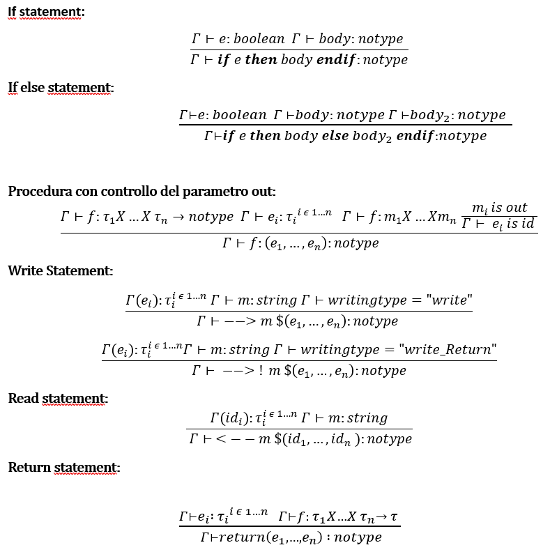

Per la lettura dell’albero in formato xml, l’analisi semantica e la generazione del codice intermedio,
sono state utilizzate quattro classi, rispettivamente:
- PrintXMLTreeVisitor
- ScopeVisitor (prima visita dell'albero)
- SemanticVisitor (seconda visita dell'albero) 
- Toy2ToCVisitor

Queste quattro classi utilizzando il design pattern Visitor per effettuare la visita completa dell'albero
dato in input, generato dal parser cup e arricchito con i tipi grazie a ScopeVisitor e SemanticVisitor.

## Type system
| operazione           | tipo operando1 | tipo operando2 | tipo risultante |
|----------------------|----------------|----------------|-----------------|
| PLUS,MINUS,TIMES,DIV | INTEGER        | INTEGER        | INTEGER         |
| PLUS,MINUS,TIMES,DIV | INTEGER        | REAL           | REAL            |
| PLUS,MINUS,TIMES,DIV | REAL           | INTEGER        | REAL            |
| PLUS,MINUS,TIMES,DIV | REAL           | REAL           | REAL            |
| PLUS                 | STRING         | STRING         | STRING          |
| AND,OR               | BOOLEAN        | BOOLEAN        | BOOLEAN         |
| LT,LE,GT,GE,EQ,NE    | INTEGER        | INTEGER        | BOOLEAN         |
| LT,LE,GT,GE,EQ,NE    | INTEGER        | REAL           | BOOLEAN         |
| LT,LE,GT,GE,EQ,NE    | REAL           | INTEGER        | BOOLEAN         |
| LT,LE,GT,GE,EQ,NE    | REAL           | REAL           | BOOLEAN         |
| UMINUS               | INTEGER        | /              | INTEGER         |
| UMINUS               | REAL           | /              | REAL            |
| NOT                  | BOOLEAN        | /              | BOOLEAN         |

### Operazioni aggiunte: concatenazione e confronto tra stringhe, confronto tra booleani

| operazione        | tipo operando1  | tipo operando2 | tipo risultante |
|-------------------|-----------------|----------------|-----------------|
| PLUS              | INTEGER         | STRING         | STRING          |
| PLUS              | STRING          | INTEGER        | STRING          |
| PLUS              | REAL            | STRING         | STRING          |
| PLUS              | STRING          | REAL           | STRING          |
| PLUS              | BOOLEAN         | STRING         | STRING          |
| PLUS              | STRING          | BOOLEAN        | STRING          |
| LT,LE,GT,GE,EQ,NE | STRING          | STRING         | BOOLEAN         |
| LT,LE,GT,GE,EQ,NE | STRING          | STRING         | BOOLEAN         |
| EQ,NE             | BOOLEAN         | BOOLEAN        | BOOLEAN         |

### Controlli aggiunti al type system:
